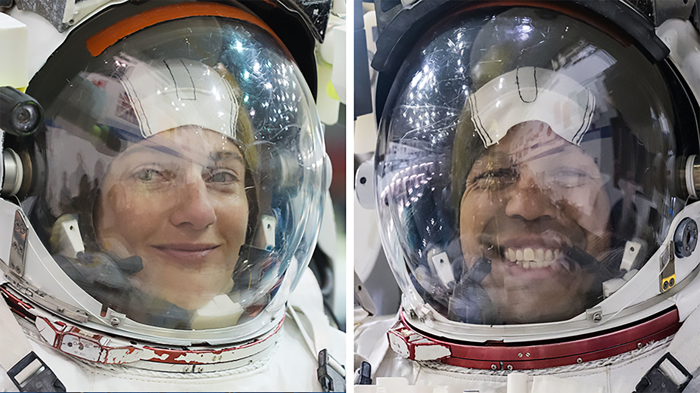
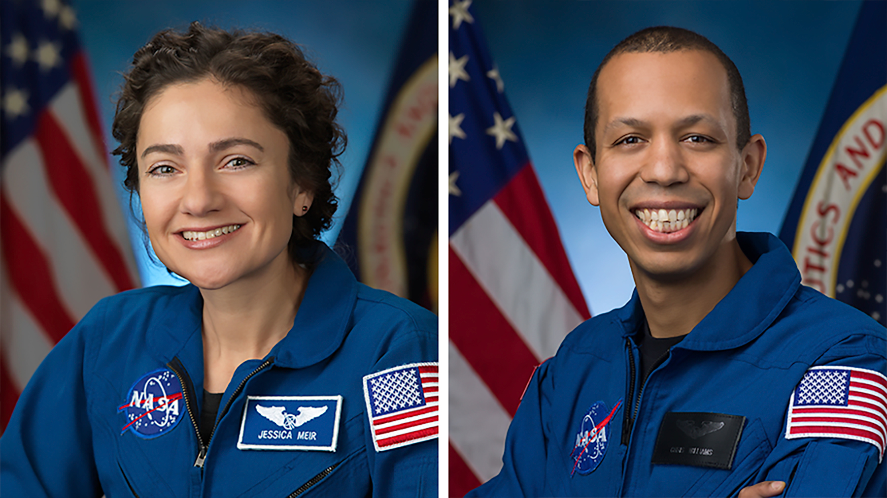

# NASA 每日新闻：2026-03-18

## 1. NASA宇航员出舱执行任务，为国际空间站安装新型太阳能电池阵列升级套件

美国东部时间上午8:52，NASA宇航员杰西卡·梅尔与克里斯·威廉姆斯开启了太空行走任务。此次出舱的主要目标是为2A电力通道进行升级准备，以便后续安装新型卷曲式太阳能电池阵列。这些新型阵列部署后，将为轨道实验室提供更充足的电力支持，确保关键系统高效运行，并为未来空间站安全、受控的离轨任务提供必要保障。

来源: https://www.nasa.gov/blogs/spacestation/2026/03/18/spacewalkers-exit-station-for-solar-array-mod-kit-install/

---

## 2. NASA宇航员今日出舱执行太空行走，将安装太阳能电池阵列升级套件

目前，两名NASA宇航员正在国际空间站外进行太空行走的现场直播准备工作。此次出舱任务旨在安装太阳能电池阵列升级套件，以提升空间站的电力供应能力。预计整个太空行走过程将持续约六个半小时。地面任务控制中心正密切监控各项操作，确保宇航员在执行复杂安装任务时的安全与进度。此次任务是空间站持续维护与升级计划的重要组成部分，旨在为未来的科学研究提供更充足的能源保障。

来源: https://www.nasa.gov/blogs/spacestation/2026/03/18/spacewalkers-prep-to-install-solar-array-mod-kit-today/

---

